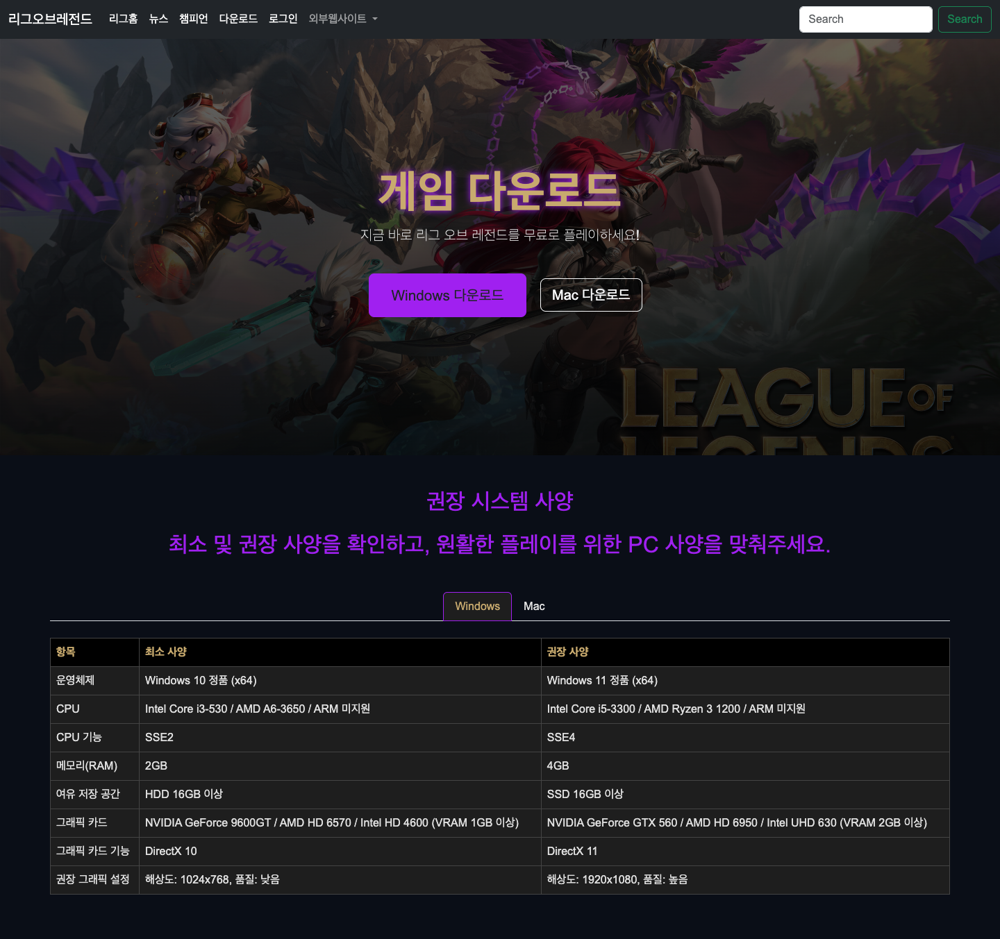
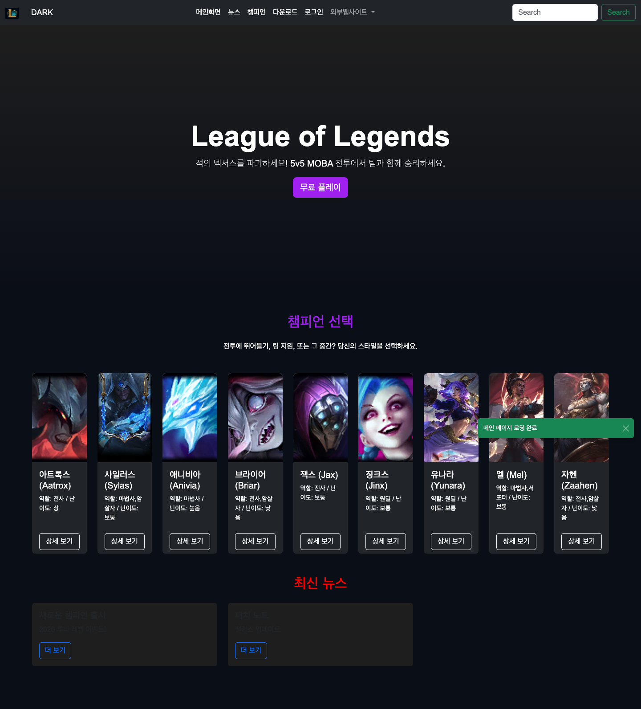
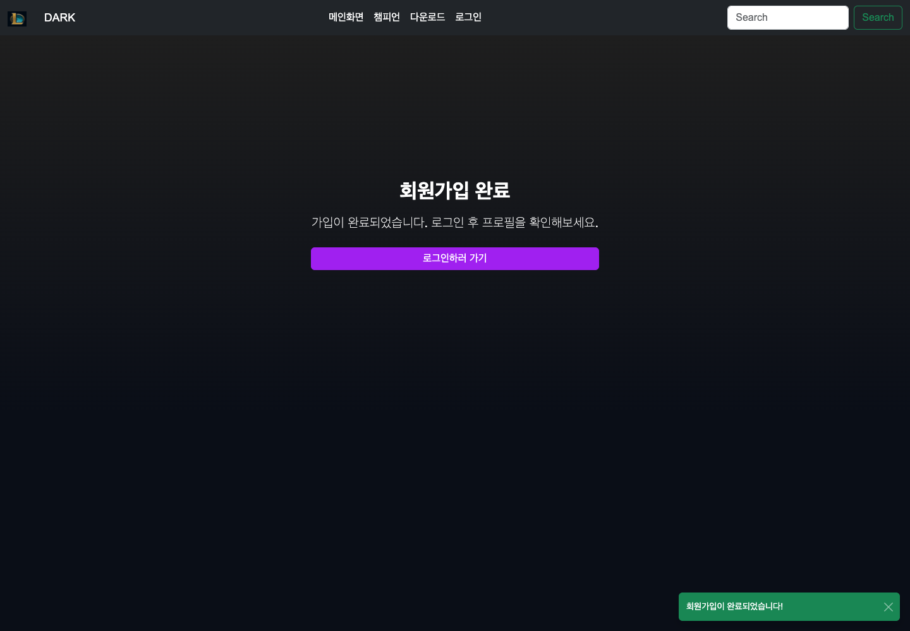
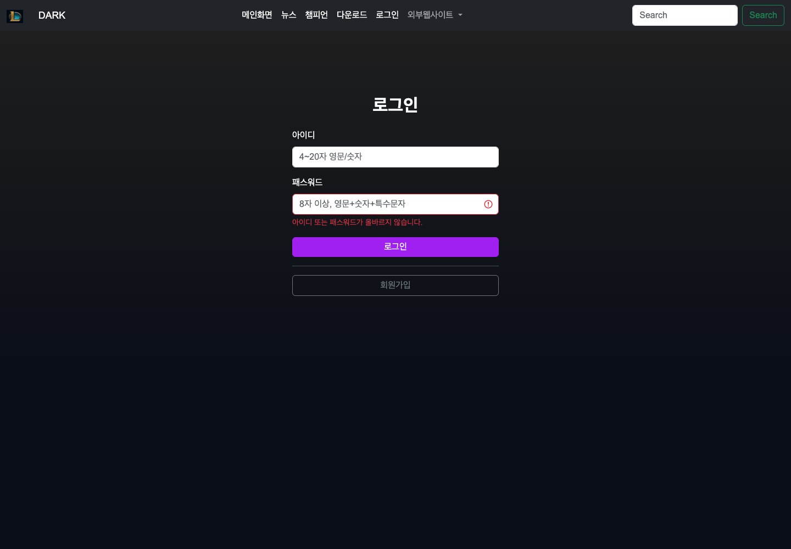
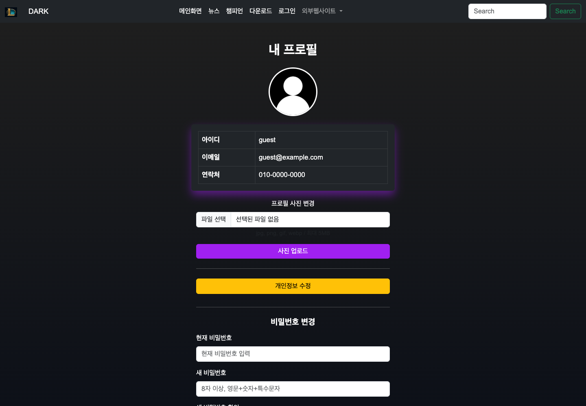
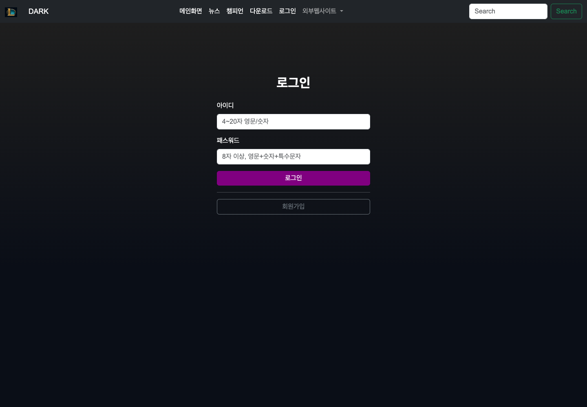
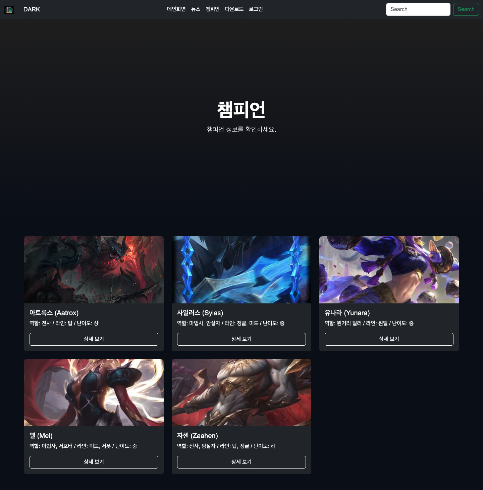

# Quarkus Java Web Project

> 학번: 20230968  
> 이름: 기경민  
> 주제: League of Legends 테마 회원관리 웹사이트

Quarkus 기반 자바 웹 프로그래밍 수업 프로젝트입니다.  
정적 HTML 페이지에서 시작해 챔피언 소개, 검색, MySQL 연동, 회원가입, 로그인, 세션, 프로필 이미지 업로드, 회원정보 수정, 비밀번호 변경까지 주차별로 기능을 확장했습니다.

---

## 프로젝트 주요 기능

- LoL 테마 메인 페이지, 챔피언 페이지, 다운로드 페이지 구성
- Bootstrap 기반 네비게이션 바, 카드, 모달, Toast UI 구현
- 챔피언 검색 기능 및 검색 결과 화면 구성
- MySQL 데이터베이스 연동
- Hibernate ORM with Panache 기반 사용자/챔피언 데이터 관리
- 회원가입, 아이디/이메일 중복 검사
- SHA-256 기반 비밀번호 해시 처리
- 로그인/로그아웃 및 세션 관리
- 로그인 실패 메시지 처리
- 프로필 페이지 및 프로필 이미지 업로드
- 이미지 확장자/용량 검사 및 업로드 오류 메시지 처리
- 개인정보 수정 및 비밀번호 변경
- 비밀번호 변경 후 자동 로그아웃 처리

---

## 사용 기술

- Java 25
- Quarkus 3.32.2
- RESTEasy Reactive
- Hibernate ORM with Panache
- MySQL JDBC
- Bootstrap 5
- HTML / CSS / JavaScript

---

## 실행 방법

```bash
./mvnw quarkus:dev
```

브라우저에서 아래 주소로 접속합니다.

```text
http://localhost:8080/
```

기본 테스트 계정입니다.

```text
아이디: guest
비밀번호: 123123
```

---

## 주요 파일 구조

```text
src/main/java/org/acme
├── champion
│   ├── Champion.java
│   └── ChampionResource.java
├── common
│   └── DataSeeder.java
├── login
│   ├── AuthResource.java
│   ├── SessionConfig.java
│   └── User.java
├── GreetingResource.java
└── StartWebSocket.java

src/main/resources/META-INF/resources
├── css
├── image
├── js
├── login
├── main_page_sub
├── modals
├── uploads/profile
└── main_index.html
```

---

## 주차별 진행 내용

### 2 · 3주차

- Quarkus 프로젝트 환경 구축
- HTML 기본 구조 학습
- LoL 메인 화면 초안 제작
- 정적 리소스 경로 및 이미지 출력 확인

<div align="center">
  
  
</div>

### 4주차

- Bootstrap 네비게이션 바 구성
- LoL 로고 삽입
- 메뉴 가운데 정렬 적용
- 챔피언 카드 UI 구성 시작

<div align="center">
  
</div>

### 5주차

- 다운로드 페이지 구성
- `download.css` 분리
- LoL 실행 파일 다운로드 링크 구성
- Aatrox 챔피언 모달 페이지 추가

<div align="center">
  
    
</div>

### 6주차

- 챔피언 목록 화면 확장
- Bootstrap JavaScript 연동
- 검색 기능 구현 준비
- 모달 및 JS 구조 정리 진행

> 화면 기능 확장 준비 단계로 별도 캡처 없음

### 7주차

- 챔피언 검색 기능 추가
- `search.js`, `search.css` 작성
- 챔피언 데이터 정의 추가
- Jax, Jinx, Mel, Yunara, Zaahen 등 챔피언 모달 추가

<div align="center">
  
  
  
</div>

### 8주차

- 별도 커밋 기록 없음
- 이전 주차 기능 보완 및 코드 정리 중심으로 진행

> 별도 캡처 없음

### 9주차

- Maven/Quarkus 설정 보완
- MySQL 연결 설정 추가
- `application.properties` 데이터베이스 설정 구성
- WebSocket 실습 코드 추가

> DB 연결 및 서버 설정 중심 작업으로 별도 캡처 없음

### 10주차

- `Champion` 엔티티 및 `ChampionResource` 추가
- `DataSeeder`로 초기 챔피언/사용자 데이터 입력
- 로그인 페이지와 로그인 후 메인 화면 구성
- 기존 메인 페이지 구조 정리

<div align="center">
  
</div>

### 11주차

- 회원가입 기능 구현
- `User` 엔티티 추가 및 사용자 정보 저장
- 아이디/이메일 중복 검사
- 입력값 유효성 검사 JS 작성
- SHA-256 기반 비밀번호 해시 처리
- 회원가입 완료 페이지 추가

<div align="center">
  
</div>

### 12주차

- 로그인 비밀번호 해시 비교 처리
- 로그인 실패 시 오류 메시지 표시
- 세션 기반 로그인 상태 관리
- 로그인 후 메인 화면 분기
- 프로필 페이지 추가
- 사용자 이메일/연락처/프로필 이미지 표시
- 프로필 이미지 업로드 구현
- 이미지 확장자 및 5MB 용량 제한 처리
- 업로드 실패 사유별 오류 메시지 표시

<div align="center">
  
  
  
</div>

### 13주차

- 브라우저 기본 `alert()`를 Bootstrap Toast 알림으로 교체
- 로그인 후 메인 화면의 프로필 링크에 사용자명 Tooltip 표시
- 프로필 페이지에 개인정보 수정 폼 추가
- 이메일/연락처 정규식 검사 및 중복 이메일 검사 구현
- 비밀번호 변경 폼 추가
- 현재 비밀번호 확인 후 새 비밀번호 SHA-256 해시 저장
- 비밀번호 변경 성공 시 Toast 표시 후 자동 로그아웃
- 챔피언/다운로드 페이지 링크 정리
- 비어 있던 챔피언 페이지와 회원가입 완료 페이지 보완
- 모든 페이지 검색창 동작 흐름 보완

<div align="center">
  
</div>

---

## 최종 정리

- 2주차부터 13주차까지 수업 내용을 주차별로 구현
- 회원가입, 로그인, 프로필, 회원정보 수정, 비밀번호 변경까지 회원관리 흐름 완성
- Toast 알림, Tooltip, 검색 기능, 챔피언/다운로드 페이지 등 프론트 기능 정리
- GitHub 제출용 README와 화면 캡처 정리 완료
